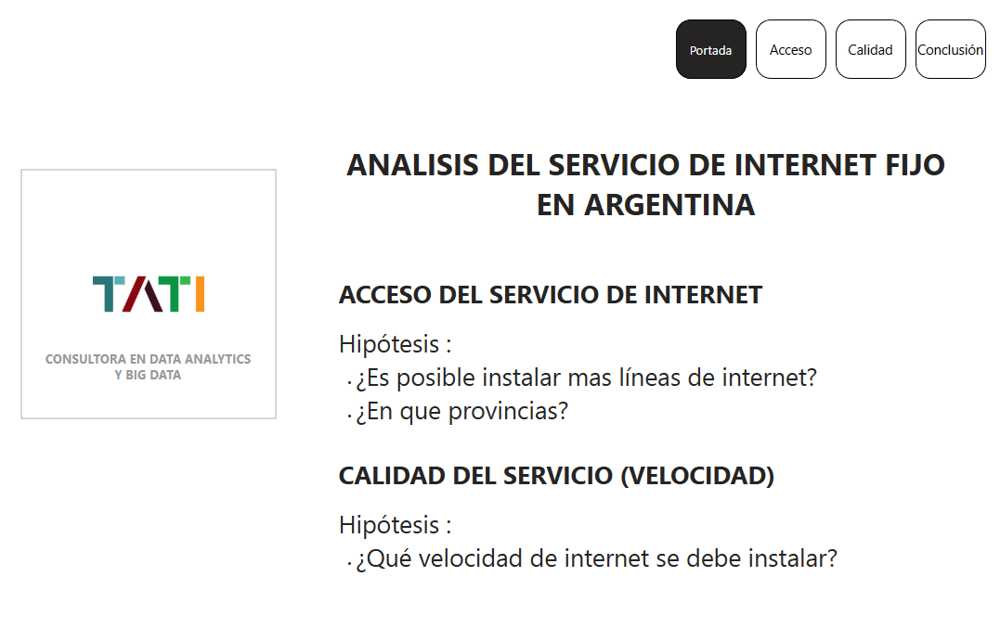
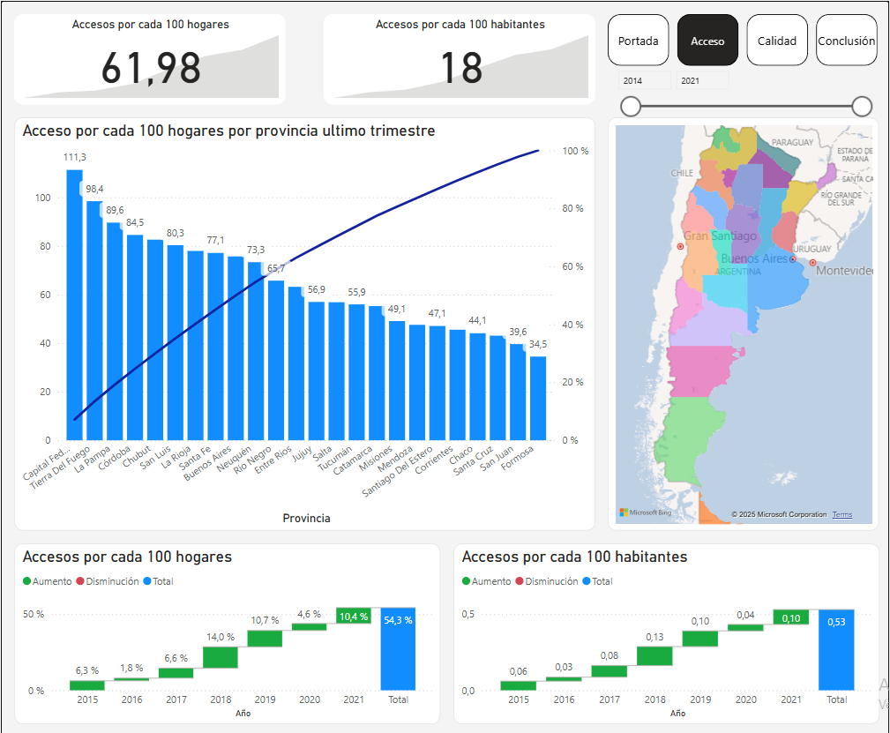
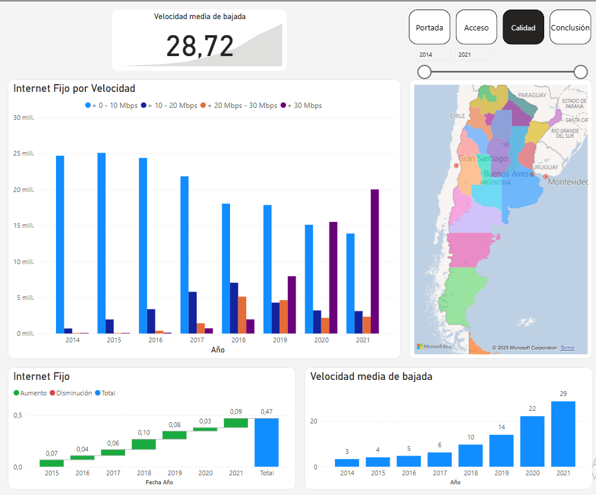
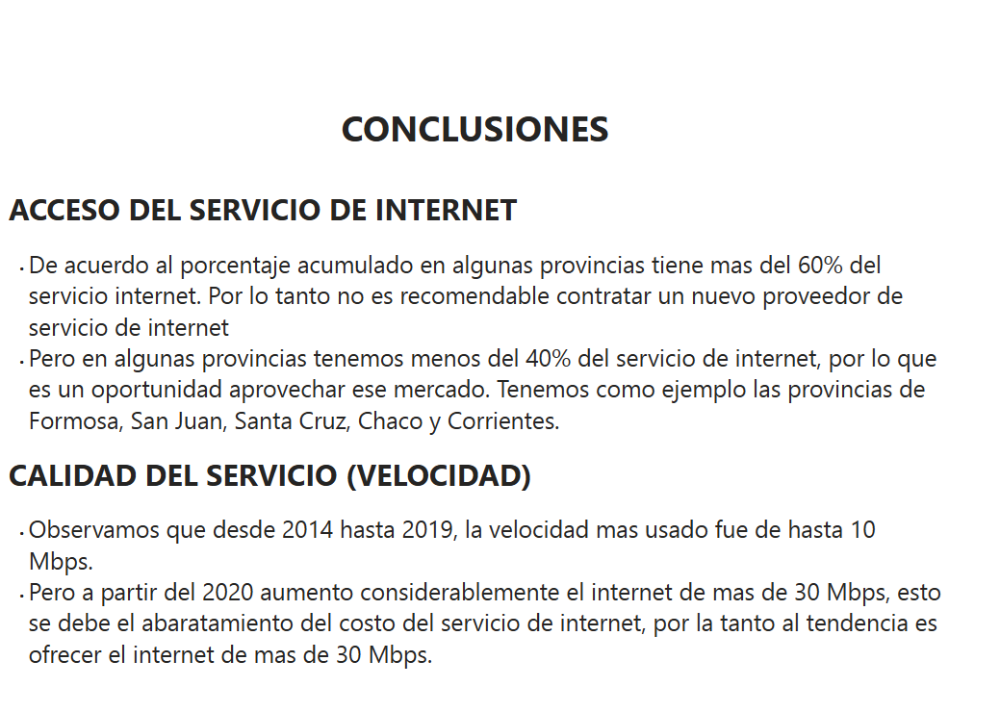

# Analisis del servicio de internet fijo en Argentina, Dashboard en Power BI

Se hace un analisis del servicio de internet en el mercado argentino. Se enfoca a la Calidad del servicio y a la penetracion de internet fijo.

## CONTENIDO - CODIGO FUENTE

- [Dashboard_Cloud_Miguel_Ramos.pbix](Dashboard_Cloud_Miguel_Ramos.pbix): Dashboard en Power Bi

## DESCRIPCION

Portada

Acceso

Calidad

Conclusion

